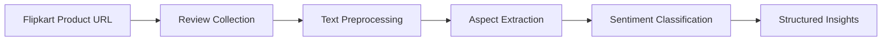

# 🧠 Flipkart Review Insight Engine

### Aspect-Based Sentiment Analysis (ABSA) for Product Insights

---

## 🚀 Overview

The **Flipkart Review Insight Engine** is an end-to-end NLP system that analyzes customer reviews at a fine-grained level.

It:

* Collects customer reviews from Flipkart product pages
* Cleans and preprocesses raw text data
* Extracts key product aspects (e.g., battery, camera, quality)
* Predicts sentiment for each aspect using Machine Learning models

👉 This enables **deeper product insights** beyond simple positive/negative classification.

Example:

* Battery → Positive ✅
* Camera → Negative ❌
* Quality → Neutral ⚖️

---

## ⚙️ End-to-End Pipeline



### 🔍 Pipeline Breakdown

* **Review Collection** → Extract reviews from product pages
* **Preprocessing** → Clean text, remove noise, normalize
* **Aspect Extraction** → Identify product features
* **Sentiment Analysis** → Predict sentiment per aspect
* **Output** → Structured insights (JSON / analysis-ready format)

---

## 🎯 Key Features

* 🔍 Aspect extraction from unstructured reviews
* 😊 Aspect-level sentiment classification
* 📊 Converts raw reviews into structured insights
* ⚡ Fully offline pipeline (no API required)
* 🧠 Practical implementation of NLP techniques

---

## 🧠 Tech Stack

### Machine Learning & NLP

* Python
* scikit-learn
* spaCy / NLTK

### Data Processing

* Pandas
* NumPy

### Data Collection

* Custom review extraction script (Flipkart product pages)

---

## 📊 Example Output

```json
{
  "review": "The battery is amazing but the camera is poor",
  "aspects": [
    {"aspect": "battery", "sentiment": "positive"},
    {"aspect": "camera", "sentiment": "negative"}
  ]
}
```

---

## 📁 Project Structure

```
├── data/                # Collected reviews
├── notebooks/           # EDA & experiments
├── src/
│   ├── preprocessing.py
│   ├── aspect_extraction.py
│   ├── sentiment_model.py
│   └── pipeline.py
├── models/              # Saved models
├── scraper/             # Review collection scripts
├── requirements.txt
└── README.md
```

---

## 🛠️ Installation

```bash
git clone https://github.com/your-username/flipkart-review-insight-engine.git
cd flipkart-review-insight-engine
pip install -r requirements.txt
```

---

## ▶️ Usage

1. Run review collection:

```bash
python scraper/fetch_reviews.py
```

2. Run pipeline:

```bash
python src/pipeline.py
```

---

## 💡 Use Cases

* 🛒 E-commerce product analysis
* 📊 Customer feedback understanding
* 📢 Brand sentiment tracking
* 🧾 Product improvement insights

---

## 📈 Future Improvements

* 🔥 Add real-time dashboard (Streamlit)
* 🌍 Multi-language support
* 🤖 Upgrade to transformer-based models (BERT)
* ⚙️ Add deployment (API + Docker)

---

## ⚠️ Disclaimer

This project is for educational purposes only. Ensure compliance with website policies when collecting external data.

---

## 🤝 Contributing

Contributions are welcome! Feel free to fork and submit a PR.

---

## 📬 Contact

* LinkedIn: https://linkedin.com/in/rahul99699
* Email: [r9979413@gmail.com](mailto:r9979413@gmail.com)

---

⭐ If you found this project useful, consider giving it a star!
